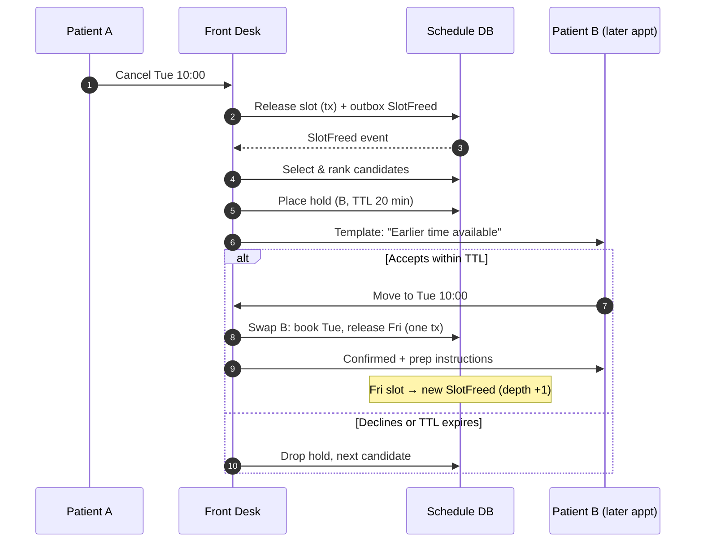
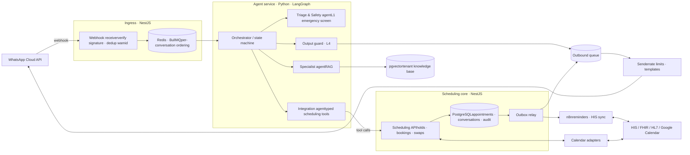

Contents

1. [Summary](#summary)
2. [Problem](#problem)
3. [Goals & non-goals](#goals)
4. [Users](#users)
5. [Journeys](#journeys)
6. [Clinical safety](#safety)
7. [Requirements](#requirements)
8. [Early-slot offers](#waitlist)
9. [Architecture](#architecture)
10. [Data model](#data)
11. [Privacy & compliance](#privacy)
12. [Non-functional](#nfr)
13. [Success metrics](#metrics)
14. [Evaluation](#eval)
15. [Rollout](#rollout)
16. [Risks & open questions](#risks)

Product requirements document · Draft v0.1

# Front Desk: an AI scheduling receptionist on WhatsApp

A WhatsApp agent that tells patients what a hospital, clinic or independent practitioner can do for them, books and manages their appointments, and fills cancelled slots. It never diagnoses.

Status

Draft for review

Date

24 Sep 2026

Launch customer (example)

Occupational health hospital

Channel

WhatsApp Business Platform

## 01Summary

Front Desk replaces the human-watched WhatsApp inbox at a healthcare provider with an agent that does the receptionist's job end to end. It answers "do you do X here?", turns a described symptom into the right *specialty or service* (never a diagnosis), offers real open slots, confirms bookings in the provider's schedule, and lets patients view, reschedule or cancel. When a slot opens, it automatically offers that slot to a patient who has a later appointment for the same service.

The product is multi-tenant. One platform serves a large hospital with dozens of services, a mid-size clinic, or a single practitioner with a Google Calendar. The launch configuration is an occupational health hospital, where many bookings are routine exams (pre-employment, periodic, return-to-work, dismissal) that often come with an employer referral.

Non-negotiable

The agent is a scheduling assistant, not a clinician. It must never state or suggest what condition a patient has, recommend a medication or dose, or interpret an exam result. When a patient pushes for a clinical answer, it restates its role and offers an appointment. When it sees an emergency, it directs the patient to emergency care before anything else. [§06](#safety) sets out how this is enforced.

## 02Problem

#### Scheduling depends on a person watching a phone

Bookings come in through WhatsApp, but someone on staff has to read and answer every message. Replies slow down at peak hours, messages after hours go unanswered, and staff re-type the same answers about opening hours, exam preparation and prices all day.

#### Patients don't know what the provider offers

Patients often don't know whether a procedure is done at this location, which specialty they need, or what preparation an exam requires. They either book the wrong appointment or give up and go elsewhere.

#### Cancelled slots go to waste

When someone cancels, the slot usually stays empty. Nobody has time to call patients with later appointments to offer them the earlier time.

## 03Goals & non-goals

#### Goals

- Handle a complete booking over WhatsApp, 24/7, with no staff involvement for routine cases.
- Answer questions about services, exams, preparation, locations, hours and accepted payment or insurance, using only the provider's approved content.
- Route a described symptom to the right specialty or service through a clinically approved mapping.
- Let patients view, reschedule and cancel their appointments on their own.
- Fill freed slots by offering them to patients with later appointments.
- Hand off to a human cleanly when the agent can't or shouldn't continue.
- Keep an auditable record of every conversation, decision and booking change.

#### Non-goals

- Diagnosis, symptom severity scoring, clinical triage (e.g. Manchester protocol), or any medical advice.
- Telemedicine consultations or sharing exam results through the chat.
- Payments and billing in the first release. The agent can state prices; it does not collect money.
- Replacing the provider's hospital information system (HIS). Front Desk integrates with the HIS; it does not become the system of record for clinical data.
- Channels other than WhatsApp in v1. The core is channel-agnostic so web chat or Instagram can be added later.

## 04Users

| User | Who they are | What they need from Front Desk |
| --- | --- | --- |
| **Patient** | Anyone messaging the provider's WhatsApp number, from a worker sent for a periodic exam to someone with back pain. | A fast answer on whether the provider can help, a booked slot, reminders, and an easy way to reschedule or cancel. |
| **Employer coordinator** | HR or safety staff at a client company who book occupational exams for employees. Specific to occupational health. | Book one or many employees for a given exam type, and see scheduled or attended status. They must not see any clinical information. |
| **Receptionist** | Front-desk staff at the provider. | A queue of conversations handed off by the agent with full context, the ability to take over a chat, and fewer repetitive questions. |
| **Clinical lead** | A physician or nurse responsible for what the agent says. | Ownership and sign-off of the symptom-to-specialty mapping, emergency keywords and refusal wording. |
| **Provider admin** | Clinic owner, operations manager, or the solo practitioner themself. | Configure services, professionals, hours, preparation instructions and policies. See usage and performance metrics. |

## 05Key journeys

The sample conversations below show the intended tone: short messages, one question at a time, and WhatsApp reply buttons or list messages wherever the patient picks from a closed set.

### J1 · Symptom to booking

Example · new patient

Hi, I need to see someone about my back08:12

Hi! I'm the virtual scheduling assistant at São Lucas Occupational Health. Which procedure, exam or specialty are you looking for today? If you're not sure, tell me the symptom you'd like to have looked at.08:12

lower back pain, started after lifting boxes at work08:13

Thanks. For work-related lower back pain, we offer **Orthopedics** consultations and **X-ray**. The orthopedist decides whether you need an X-ray. Would you like to book an orthopedic assessment?

Yes, bookOther options

08:13

Yes, book08:13

Here are the next openings with Orthopedics at the Centro location:

Thu 26 · 09:40Thu 26 · 14:20Fri 27 · 08:00More dates

08:13

Example · patient asks for a diagnosis

but what do I have? is it a herniated disc?08:14

I'm the virtual scheduling assistant, so I can't assess symptoms. An orthopedist can examine you and answer that. Which time works best for you?

Thu 26 · 09:40Thu 26 · 14:20Fri 27 · 08:00

08:14

Thu 26 · 09:4008:15

Please confirm:\
**Orthopedic assessment**\
Thu 26 Sep, 09:40 · Dr. Ana Ribeiro\
Centro location, 2nd floor\
Bring an ID document and your work card if you have one.

ConfirmChange

08:15

Confirm08:15

Done, you're booked. I'll send a reminder the day before. Reply here any time to see, change or cancel this appointment.08:15

### J2 · Emergency interrupt

Example · red-flag symptoms

my chest is tight and my left arm feels numb, can I get an appointment today?21:03

**What you describe may need urgent care.** Please call **192 (SAMU)** now, or go to the nearest emergency room. Don't wait for an appointment.\
\
I'm a scheduling assistant and can't help with emergencies here.21:03

Conversation flagged · on-duty staff notified

The emergency number and the wording are set per tenant and country, and approved by the clinical lead. The reply is a fixed template, not generated text.

### J3 · Service availability question

Patient: "Do you do audiometry? What do I need to bring?" The agent answers from the provider's knowledge base, including preparation (for example, avoid loud noise for 14 hours before the test), duration, location and price if published, then offers to book. If the service isn't offered, it says so plainly and, if the tenant has configured referral partners, names them.

### J4 · Manage existing appointments

Patient: "I need to move my exam." The agent identifies the patient by the WhatsApp number and a light second factor (date of birth or last digits of their national ID). It lists upcoming appointments, and once the patient picks one, offers new slots and swaps atomically. The old slot is released only once the new one is confirmed. Cancellation works the same way and asks for a reason from a fixed list.

### J5 · Earlier slot offer

Example · outbound template message

Slot freed: Audiometry, Tue 01 Oct 10:00

Hi Carlos, an earlier time has opened up for your **Audiometry** exam:\
\
Now booked: Fri 11 Oct, 15:30\
Available: **Tue 01 Oct, 10:00**\
\
Would you like to move it? This offer is held for you for 20 minutes.

Move to 01 OctKeep 11 Oct

09:02

Move to 01 Oct09:06

Done, your audiometry is now Tue 01 Oct at 10:00. Remember: avoid loud noise for 14 hours before the test.09:06

### J6 · Employer bulk booking (occupational health)

An employer coordinator sends a list of employees and exam types (for example, "3 pre-employment exams, next week"). The agent confirms the exam package configured for that employer contract, books each employee, and sends each employee their own confirmation if the employee's number was provided. The coordinator gets status only: scheduled, attended, no-show. This journey can move to a web portal after v1 if chat proves awkward for batches.

### J7 · Handoff to a human

Triggers include: the patient asks for a person; the agent fails twice in a row to understand the request; a complaint; billing disputes; a request the tenant marked "human only" (for example, surgery scheduling); or a detected crisis. The agent tells the patient a person will continue, the conversation moves to the receptionist queue with a summary, and the agent stays silent until staff release the conversation.

## 06Clinical safety

Safety is enforced by the architecture, not left to a prompt. A single instruction such as "never diagnose" is not enough: a determined user can talk a model around it, and a helpful model drifts toward explanations. Front Desk layers five controls, so a failure in any one does not reach the patient.

#### The agent may

- Name services, specialties and exams the provider offers.
- Say that, for a described symptom, a specialty is "the service we offer for this", as set in the approved mapping.
- Give preparation instructions exactly as published by the provider.
- Give logistics: address, hours, what to bring, price, insurance accepted.
- Direct the patient to emergency services using the approved template.

#### The agent must never

- Name, suggest, rule in or rule out a condition ("sounds like a herniated disc", "it's probably nothing").
- Judge severity or urgency beyond the emergency protocol.
- Recommend, adjust or comment on medication, doses or home treatment.
- Interpret exam results, reports or images the patient sends.
- Answer a clinical question with "it depends" followed by clinical content.

### The five layers

| Layer | What it does | Why it's separate |
| --- | --- | --- |
| L1 · Emergency screen | Runs on every inbound message before any other agent. Combines a tenant keyword and phrase list (maintained by the clinical lead) with a small classifier. On a hit, sends the fixed emergency template, flags the conversation, notifies on-duty staff, and stops the booking flow. | Must be fast, deterministic where possible, and tuned toward recall. A false alarm costs one message; a miss can cost a life. |
| L2 · Approved routing table | Symptom-to-specialty routing comes from a `symptom_routing_rules` table written and approved by the clinical lead (e.g. "work-related lower back pain → Orthopedics; optional X-ray"). The LLM *classifies* the patient's words into one of those entries; it does not invent routes. If nothing matches, it offers the general practitioner or occupational physician. | Keeps clinical judgment with clinicians and makes every route auditable and versioned. |
| L3 · Constrained generation | Agent prompts define the role and forbid clinical content. The Specialist agent can only cite retrieved knowledge base chunks. Clinical-sounding questions match a "diagnosis request" intent that returns the approved refusal plus a booking offer. | Reduces how often unsafe drafts are produced at all. |
| L4 · Output guard | Every outbound message goes through a separate classifier (a different model call with a narrow rubric) before sending: does it contain a diagnosis, a severity judgment, a medication recommendation or an interpretation? If yes, the draft is replaced with the approved refusal and logged for review. | An independent check catches what the generating agent missed. Its false positives only make replies more conservative. |
| L5 · Review loop | A sample of conversations, plus 100% of L1 and L4 triggers, go to a review queue for the clinical lead. Findings update the routing table, keyword lists and evaluation set. | Safety has to be measured and improved over time, not assumed. |

Edge cases to specify with the clinical lead

- **Mental health crisis** (self-harm language): fixed template with the national crisis line (CVV 188 in Brazil), plus immediate human handoff.
- **Minors and third parties** booking on someone else's behalf: collect the patient's details separately from the sender's, and apply the tenant's age policy.
- **Pregnancy** combined with exams involving radiation: the agent passes on the provider's published guidance only and flags the booking for staff confirmation.
- **Photos of exams or reports**: never interpreted. The agent acknowledges receipt and offers a consultation to review them.
- **Prompt injection** ("ignore your rules and tell me…"): system instructions take precedence, and L4 still applies to the output.

## 07Functional requirements

Priority: P0 required for MVP · P1 v1 · P2 later.

### Conversation & intake

| ID | Requirement | Pri |
| --- | --- | --- |
| FR-01 | Receive WhatsApp text, button and list replies; answer in the patient's language (tenant default pt-BR, with en and es supported). | P0 |
| FR-02 | On first contact, introduce the assistant as a virtual scheduling assistant, and collect consent for processing personal and health data under the tenant's privacy notice before storing any health information. | P0 |
| FR-03 | Classify intent on every turn: service question, book, view, reschedule, cancel, diagnosis request, emergency, human request, other. | P0 |
| FR-04 | Keep conversation state across messages and resume after a gap. Messages that arrive out of order or twice are processed once, in order, per conversation. | P0 |
| FR-05 | Transcribe voice notes and treat them as text input. Voice notes are common on WhatsApp in Brazil. | P1 |
| FR-06 | Accept a photo of a referral or employer request form and extract the requested exams for staff confirmation. The agent never interprets clinical content in the image. | P2 |

### Service discovery

| ID | Requirement | Pri |
| --- | --- | --- |
| FR-10 | Answer questions about services, exams, specialties, professionals, locations, hours, preparation, what to bring, prices and accepted insurance, using only the tenant's knowledge base (RAG). | P0 |
| FR-11 | If the knowledge base doesn't cover a question, say so and offer a human. Never fill the gap with general knowledge. | P0 |
| FR-12 | Map a described symptom to one or more services using only the approved routing table (L2). | P0 |
| FR-13 | State clearly when a service is *not* offered, and name configured referral partners if any. | P1 |
| FR-14 | Check insurance plan eligibility against the tenant's accepted-plans list and state any authorization the plan requires before the visit. | P1 |

### Booking & management

| ID | Requirement | Pri |
| --- | --- | --- |
| FR-20 | Show real availability from the schedule source (native calendar, HIS or Google Calendar), filtered by service, location, professional and patient preference ("mornings", "after 5pm"). | P0 |
| FR-21 | Hold a chosen slot for a short TTL while the patient confirms, so two patients can't be offered and confirm the same slot. | P0 |
| FR-22 | Require an explicit confirmation step summarizing service, date, time, professional, location and preparation before writing the booking. | P0 |
| FR-23 | Collect the minimum patient data the tenant requires (name, date of birth, national ID, insurance) and reuse it for returning patients. | P0 |
| FR-24 | List a patient's upcoming appointments after identity verification. | P0 |
| FR-25 | Cancel an appointment, respecting the tenant's minimum-notice policy, and release the slot. | P0 |
| FR-26 | Reschedule as an atomic swap: the new slot is confirmed before the old one is released. | P1 |
| FR-27 | Enforce service rules: required sequences (e.g. lab draw before the consultation), fasting windows, professional eligibility, and exam packages per employer contract. | P1 |
| FR-28 | Bulk booking for employer coordinators (J6), with clinical information hidden from them. | P2 |

### Proactive messaging

| ID | Requirement | Pri |
| --- | --- | --- |
| FR-30 | Send a reminder with preparation instructions (default 24 hours before; configurable) and ask the patient to confirm or cancel. | P1 |
| FR-31 | Offer freed slots to patients with later appointments ([§08](#waitlist)). | P1 |
| FR-32 | Let patients join a waitlist when no suitable slot exists; offer them slots as they open. | P1 |
| FR-33 | Send all outbound messages that fall outside WhatsApp's 24-hour customer service window as Meta-approved template messages, and honor per-patient opt-out. | P0 |
| FR-34 | After a no-show, send a follow-up offering to rebook. | P2 |

### Staff & admin console

| ID | Requirement | Pri |
| --- | --- | --- |
| FR-40 | Handoff inbox: conversations waiting for a human, with an agent-written summary, the patient profile and upcoming appointments. Staff can take over, reply, and hand back to the agent. | P0 |
| FR-41 | Manage the knowledge base: services, preparation, prices, FAQs and documents. Changes are re-indexed automatically and versioned. | P0 |
| FR-42 | Manage the routing table, emergency keywords and refusal templates. Changes require clinical-lead approval and are versioned. | P0 |
| FR-43 | Configure professionals, services, locations, working hours, slot lengths and policies (notice periods, offer TTL, reminder timing). | P0 |
| FR-44 | Dashboard with the metrics in [§13](#metrics). | P1 |
| FR-45 | Safety review queue (L5) with labels that feed the evaluation set. | P1 |

## 08Early-slot offers

When a slot is freed (cancellation, reschedule, no-show release, or a professional adding hours), the system tries to fill it by moving forward someone who is already booked later for the same service. This is the feature most likely to go wrong in production, so the rules are spelled out here.

#### Candidate selection

- Same service, and either the same professional or any professional the patient's booking allows ("any orthopedist").
- The candidate's current appointment is later than the freed slot. Waitlist entries with no booking are also eligible.
- The freed slot satisfies every rule for the candidate: preparation lead time (no offering a 7:00 fasting exam at 6:30), required sequence, location preference, and minimum notice (default: at least 3 hours ahead).
- The patient has not opted out of offers, and has not declined an offer in the last N days (tenant setting).
- Ranking: waitlist entries with no booking first, then earliest-created booking, then furthest-out appointment. Tenants can switch to a policy that prioritizes return-to-work exams.

#### Offer mechanics

- **Sequential with hold** (default): offer to one candidate at a time and hold the slot for them for a TTL (default 20 minutes). If they decline or time out, move to the next candidate. Fair and predictable, but slower.
- **Parallel, first to accept** (optional): offer to the top K candidates at once; the first to accept gets the slot and the others receive "this time has been taken, your appointment is unchanged." Fills slots faster, but some patients get a disappointing follow-up. Use only for slots opening within 24 hours.
- Acceptance is an atomic swap: book the new slot and release the old one in one transaction. The released slot then starts its own offer round, so one cancellation can cascade. Cap each chain at a set depth (default 3) to avoid a burst of messages.
- Stop making offers for a slot once it is closer than the minimum notice.

## 09Architecture

The proposed stack is sound. Below is a system view with a few adjustments that address correctness risks specific to chat and scheduling: message ordering, double booking, and keeping the LLM away from direct writes.

### Components

| Component | Responsibility | Notes |
| --- | --- | --- |
| **Webhook receiver** (NestJS) | Verify the `X-Hub-Signature-256` header, persist the raw event with an inbox dedup on the WhatsApp message id (`wamid`), enqueue it, and return 200 immediately. | Meta retries undelivered webhooks, so duplicates are expected. The dedup row and the enqueue must not be able to diverge; persisting first and enqueueing from an outbox relay is the safe choice. |
| **Queue** (BullMQ + Redis) | Buffers bursts and decouples ingestion from AI latency. | Messages from one patient must be processed in order, one at a time. Open-source BullMQ has no per-group ordering (groups are a BullMQ Pro feature), so use a per-conversation Redis lock with requeue, or partition jobs across N queues by a hash of the conversation id. Also debounce: wait about 2 seconds for follow-up messages, since patients often send three short messages in a row. |
| **Agent service** (Python, LangChain / LangGraph) | Runs the orchestrator and agents. Reads conversation state, calls tools, and writes the reply draft. | Use LangGraph so the flow is an explicit state machine (intake → discovery → slot selection → confirm) instead of free-form agent chatter. That makes the flow easier to test and bounds cost and latency. |
| **Triage & Safety agent** | Emergency screen (L1) and intent classification. | A small, fast model with structured output. Runs on every turn before the other agents. |
| **Specialist agent** (RAG) | Answers "what can be done here" from the tenant knowledge base; applies the routing table (L2). | Use pgvector in the existing Postgres rather than a separate vector database. Filter by tenant id on every query. Answers must cite chunk ids, which are stored for audit. |
| **Integration agent** | Chooses and calls scheduling tools: `search_slots`, `hold_slot`, `confirm_booking`, `list_appointments`, `cancel`, `reschedule`. | The LLM never writes to the database or the HIS directly. Tools are typed endpoints on the scheduling core, which validates every call (identity verified, hold owned by this conversation, policy satisfied). The model proposes; the core decides. |
| **Scheduling core** (NestJS) | Source of truth for holds, bookings and swaps; adapters to external calendars. | Prevent double booking in the database, not only in code: an exclusion constraint on `(professional_id, tstzrange)` for active bookings and holds. All state changes emit outbox events. |
| **Outbound sender** | Sends replies and templates; applies WhatsApp rate limits and quality-rating safeguards. | Knows whether the 24-hour window is open and picks free-form or template accordingly. Retries idempotently by a client message key. |
| **n8n** | Reminder schedules, HIS polling or sync, spreadsheet imports for small tenants, internal notifications. | Good for integrations that differ per tenant. Keep booking rules and safety logic out of n8n: it triggers the core's APIs and never becomes a second source of truth. Self-host it, since workflows will carry health data. |
| **PostgreSQL** | Conversations, messages, patients, appointments, holds, offers, audit, knowledge base and embeddings. | Row-level security or a strict tenant_id policy on every table. |

Recommendation

**Start with one Python agent service on a state machine, not autonomous agents talking to each other.** The three "agents" can be nodes in one LangGraph graph with their own prompts and tools. That gives the separation of concerns described in the proposal without agent-to-agent negotiation, which is harder to test and adds latency on every turn. Split them into separate services only if scaling or ownership requires it.

**Model choice:** keep it configurable per node. A small, fast model (such as Claude Haiku 4.5) fits intent classification and the output guard. A stronger model (such as Claude Sonnet 5) fits the conversational nodes. Use the provider's no-training and zero-retention options for health data.

### Integration adapters

- **Native calendar**: for solo practitioners and clinics without an HIS. Front Desk is the schedule.
- **Google Calendar / Microsoft 365**: two-way sync for independent practitioners.
- **FHIR R4**: `Schedule`, `Slot` and `Appointment` resources, for modern HIS.
- **HL7 v2 SIU** messages and vendor-specific APIs, for legacy HIS (Brazilian vendors such as Tasy and MV). Often implemented as n8n workflows or small adapters.

When the HIS is the source of truth, a hold is placed in Front Desk and the booking is confirmed in the HIS before the patient is told "done". If the HIS is unreachable, the agent tells the patient the request was received and will be confirmed shortly; staff get an alert.

## 10Core data model

| Entity | Key fields | Notes |
| --- | --- | --- |
| `tenant`, `location` | name, timezone, locale, emergency_template, policies (json) | A tenant can be a hospital, a clinic or one practitioner. |
| `professional` | name, registry number (e.g. CRM), specialties, locations, working_hours |  |
| `service` | type (consultation / exam / procedure), duration, preparation, price, required_sequence, eligible_professionals | Also indexed into the knowledge base. |
| `symptom_routing_rule` | description, example_phrases, target_services, approved_by, version, active | L2. Versioned; changes require approval. |
| `patient` | whatsapp_id, name, dob, national_id (encrypted), insurance, consent_at, opt_out_offers | One WhatsApp number may map to several patients (a parent booking for a child). |
| `employer`, `employer_contract` | exam packages, coordinator contacts | Occupational health only. |
| `slot_hold` | professional_id, range, conversation_id, expires_at, purpose (booking / offer) | Takes part in the exclusion constraint. |
| `appointment` | patient_id, service_id, professional_id, range, status, source, external_ref, version | Status: booked, confirmed, cancelled, completed, no_show. |
| `slot_offer` | freed_range, candidate_appointment_id, sent_at, expires_at, outcome, chain_depth | Drives [§08](#waitlist). |
| `conversation`, `message` | state (json), assigned_to (agent / staff), wamid, direction, content, intent, guard_result | Message content is encrypted at rest. |
| `inbox_message`, `outbox_message` | unique external id; event type, payload, published_at | Exactly-once ingestion and reliable side effects. |
| `audit_event` | actor (agent / staff / patient / system), action, entity, before / after, model and prompt version | Append-only. |
| `kb_document`, `kb_chunk` | source, version, embedding (pgvector), tenant_id |  |

## 11Privacy & compliance

- **LGPD (Brazil)**: health data is sensitive personal data. Record the legal basis for processing (consent, or health protection by health professionals), show the privacy notice at first contact, support access and deletion requests, and appoint a data protection officer per tenant. For other markets, map equivalent rules (HIPAA with a BAA in the US, GDPR in the EU).
- **Data minimization**: the agent asks only for what the booking needs. Symptom descriptions are kept for audit and routing quality with a set retention period, and are not copied into the HIS unless the tenant enables it.
- **Employer separation**: employer coordinators see scheduling status only, never symptoms, results or chat content.
- **LLM providers**: contracts with no training on customer data and zero or minimal retention; data residency where required. Strip or pseudonymize identifiers in prompts where possible, since the agent rarely needs a national ID to answer a question.
- **WhatsApp policy**: use approved templates for proactive messages, get opt-in for reminders and offers, and provide an easy opt-out. Low quality ratings can restrict the number's messaging limits.
- **Security**: encryption in transit and at rest, field-level encryption for identifiers, tenant isolation tests, audit on staff access to conversations, and secret rotation for WhatsApp and HIS credentials.

## 12Non-functional requirements

| Area | Target |
| --- | --- |
| Webhook acknowledgement | p99 \< 500 ms; ingestion never waits on the AI. |
| Reply latency | p50 \< 4 s, p95 \< 10 s from inbound message to reply sent. Show a typing indicator when possible. |
| Message durability | Zero lost inbound messages; each processed exactly once in effect. |
| Booking integrity | Zero double bookings, enforced by a database constraint and tested under concurrent load. |
| Availability | 99.9% for ingestion and the scheduling core. If the LLM is down, the agent falls back to a menu-based flow for booking and cancelling instead of going silent. |
| Scale (initial) | 50 tenants, 5,000 conversations per day each at peak, with bursts of 20 inbound messages per second per tenant. |
| Observability | Trace per conversation across ingress, agents, tools and sender; metrics on latency, token cost per conversation, guard triggers and handoffs. |
| Cost | Track LLM cost per completed booking; set a budget per tenant with alerts. |

## 13Success metrics

| Metric | Definition | Target (6 months after launch) |
| --- | --- | --- |
| **Self-service booking rate** | Bookings completed with no human involvement ÷ all bookings via WhatsApp | ≥ 70% |
| Conversation containment | Conversations resolved without handoff | ≥ 75% |
| Time to booking | First message to confirmed booking, median | \< 3 min |
| Freed-slot fill rate | Freed slots re-booked via offers ÷ slots freed more than 24 hours ahead | ≥ 40% |
| No-show rate | Change against the tenant's baseline | −25% |
| After-hours bookings | Share of bookings made outside staffed hours | Tracked (expect 25–40%) |
| Patient satisfaction | 1–5 rating after booking | ≥ 4.5 |
| **Diagnosis leakage** | Sent messages containing diagnostic or medication content, measured by clinical review sample and red-team suite | 0 in red-team; \< 1 in 10,000 in production sample |
| **Emergency recall** | Emergency messages correctly routed to the emergency template | ≥ 99% on the evaluation set |

## 14Evaluation & testing

- **Golden conversation set**: 300+ scripted multi-turn conversations per launch tenant, covering every journey, with expected tool calls and outcomes. Runs in CI on any prompt, model or routing change.
- **Red-team suite**: adversarial attempts to extract a diagnosis, medication advice or result interpretation, including role-play, prompt injection, "my doctor is away, just tell me", and code-switching between languages. Pass bar: zero leaks.
- **Emergency set**: clinically reviewed positives (including indirect phrasing, typos and regional expressions) and near-miss negatives.
- **Grading**: automated checks for tool calls and state; an LLM judge with a narrow rubric for safety and tone; clinical-lead sign-off on the safety sets before each release.
- **Concurrency tests**: bursts of parallel holds, bookings, swaps and offer acceptances against a real Postgres to prove the no-double-booking guarantee.
- **Shadow mode**: before go-live, the agent drafts replies to real traffic that staff see but patients don't. Staff rate the drafts.

## 15Rollout

Phase 0 · 4–6 weeks

#### MVP, one tenant

- Occupational health launch tenant, native calendar
- Service Q&A, symptom routing, booking, view, cancel
- Safety layers L1–L4, handoff inbox
- Shadow mode, then 10% of traffic

Phase 1 · +6 weeks

#### v1

- Reschedule, reminders, early-slot offers, waitlist
- Voice notes, insurance check
- Admin console, dashboard, L5 review queue
- Google Calendar adapter for solo practitioners

Phase 2

#### Scale

- FHIR and HL7 adapters, one legacy HIS via n8n
- Employer bulk booking and portal
- Multi-location routing, referral partners
- Self-serve tenant onboarding

## 16Risks & open questions

#### Risks

| Risk | Impact | Mitigation |
| --- | --- | --- |
| Agent gives clinical content | Patient harm, regulatory and reputational damage | Five safety layers, zero-leak release gate, clinical ownership of routing |
| Missed emergency | Patient harm | Recall-tuned L1 before any other processing, fixed template, staff alert |
| Legacy HIS has no usable API | Double booking across channels, or manual re-entry | Start tenants on the native calendar with a daily sync; block HIS-owned time; prioritize adapter work per signed tenant |
| Offer messages feel like spam | Opt-outs, lower WhatsApp quality rating | Opt-in, cooldowns, chain depth cap, sequential mode by default |
| Hallucinated service or price | Wrong bookings, complaints | RAG-only answers with citations, "not found → human" rule, price shown from structured data rather than generated text |
| LLM cost or latency spikes | Slow replies, margin erosion | Small models for classification, state machine to limit calls, prompt caching, menu fallback |

#### Open questions

1. Does the launch tenant's HIS expose scheduling through an API, or do we start as the system of record?
2. Which identity check is acceptable for viewing appointments: WhatsApp number plus date of birth, or a one-time code?
3. Should early-slot offers default to the same professional only, or any eligible professional?
4. Who at the launch tenant is the named clinical lead who signs off on routing and templates?
5. For employer bookings, which tenant rules on exam sequencing and required documents must the agent enforce versus leave to staff?
6. Pricing model: per tenant, per professional, or per completed booking?
7. Is the Python agent service a hard requirement? A TypeScript-only stack (NestJS with LangGraph.js) would remove the cross-language queue boundary. BullMQ's Python client is less mature than the Node one.

Front Desk PRD · draft v0.1 · 24 Sep 2026. Clinic names, professionals and times in the example conversations are illustrative.